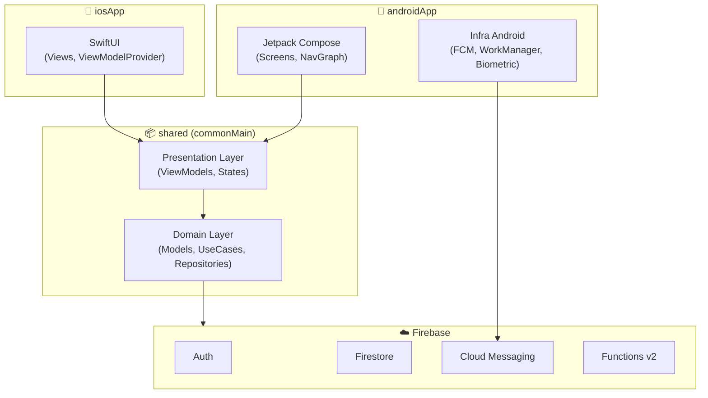
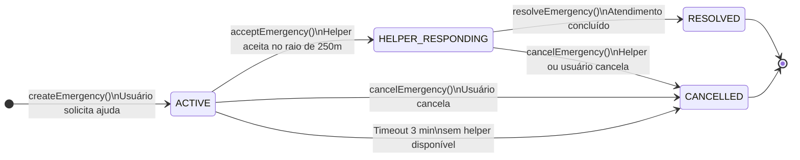
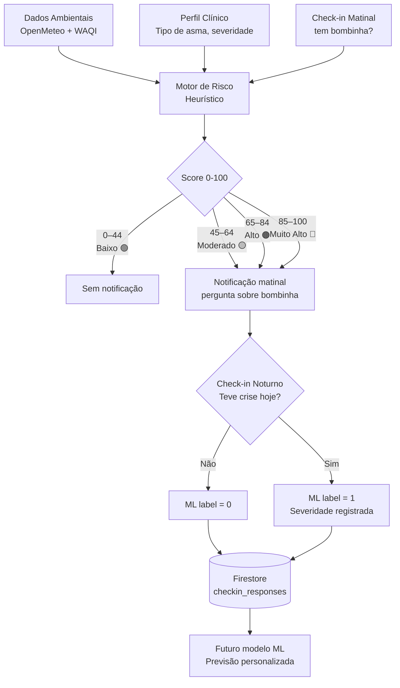
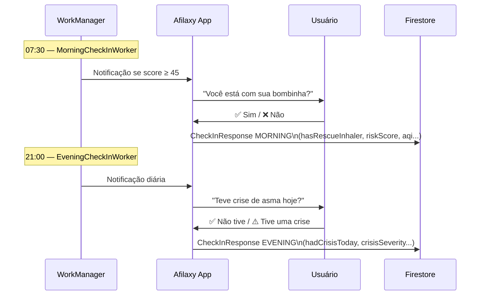
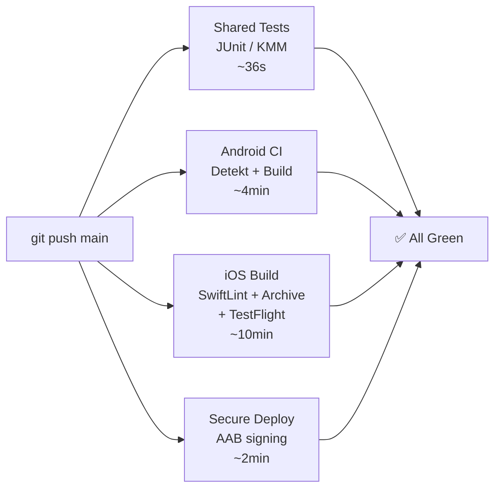

# Afilaxy — Arquitetura do Sistema

> Documentação gerada a partir do código-fonte. Atualizar junto com mudanças de domínio.

---

## Visão Geral — Kotlin Multiplatform Mobile (KMM)

---

## Fluxo de Emergência — Máquina de Estados

### Estados no Firestore

| Estado (enum) | `status` no Firestore | Descrição |
|--------------|----------------------|-----------|
| `ACTIVE` | `"waiting"` | Aguardando helper no raio de 250m |
| `HELPER_RESPONDING` | `"matched"` | Helper aceito, a caminho |
| `RESOLVED` | `"resolved"` | Atendimento concluído |
| `CANCELLED` | `"cancelled"` | Cancelada (timeout, usuário ou helper) |

---

## Fluxo de Risco de Asma — Score e Notificação

### Score de Risco — Faixas

| Faixa | Nível | Ação |
|-------|-------|------|
| 0–44 | 🟢 Baixo | Nenhuma |
| 45–64 | 🟡 Moderado | Notificação matinal |
| 65–84 | 🟠 Alto | Notificação matinal |
| 85–100 | 🔴 Muito Alto | Notificação matinal urgente |

---

## Fluxo de Check-in

---

## Arquitetura de Camadas — shared module

```mermaid
graph BT
    subgraph data["Data Layer"]
        Repos["RepositoryImpl\n(Firestore, Location, Auth...)"]
    end

    subgraph domain["Domain Layer"]
        Models["Models\n(Emergency, CheckIn, RiskScore...)"]
        Interfaces["Repository Interfaces"]
        UseCases["Use Cases\n(CreateEmergency, SendChat,\nFindHelpers, ValidateInput...)"]
    end

    subgraph presentation["Presentation Layer"]
        VMs["ViewModels\n(Emergency, Home, Medical,\nCheckIn, Login...)"]
    end

    Repos --> Interfaces
    Interfaces --> UseCases
    Models --> UseCases
    UseCases --> VMs
```

---

## CI/CD Pipeline

---

## Modelos de Domínio Principais

| Modelo | Responsabilidade |
|--------|----------------|
| `Emergency` | Pedido de socorro com status, localização e severidade |
| `EmergencyStatus` | Máquina de estados: ACTIVE → HELPER_RESPONDING → RESOLVED/CANCELLED |
| `CheckInResponse` | Resposta de check-in matinal/noturno com contexto ambiental e clínico |
| `RiskScore` | Score 0–100 com nível, fatores e recomendações |
| `AsthmaRiskLevel` | LOW / MODERATE / HIGH / VERY_HIGH |
| `EnvironmentalData` | AQI, temperatura, umidade, vento, UV, precipitação |
| `HealthProfessional` | Profissional cadastrado com especialidade, rating e planos |
| `UserProfile` | Perfil clínico: tipo de asma, severidade, medicamentos |
